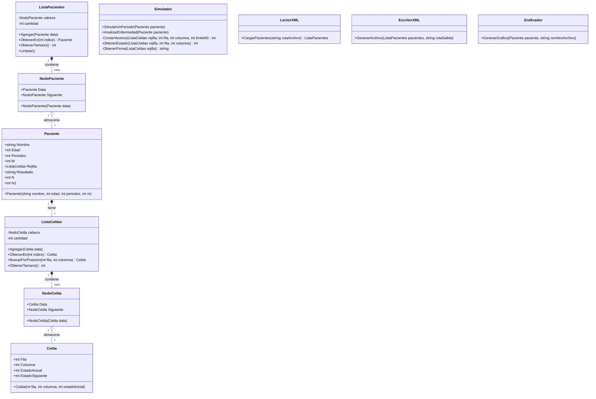

```mermaid
classDiagram
    class Paciente {
        +string Nombre
        +int Edad
        +int Periodos
        +int M
        +ListaCeldas Rejilla
        +string Resultado
        +int N
        +int N1
        +Paciente(string nombre, int edad, int periodos, int m)
    }

    class Celda {
        +int Fila
        +int Columna
        +int EstadoActual
        +int EstadoSiguiente
        +Celda(int fila, int columna, int estadoInicial)
    }

    class NodoPaciente {
        +Paciente Data
        +NodoPaciente Siguiente
        +NodoPaciente(Paciente data)
    }

    class NodoCelda {
        +Celda Data
        +NodoCelda Siguiente
        +NodoCelda(Celda data)
    }

    class ListaPacientes {
        -NodoPaciente cabeza
        -int cantidad
        +Agregar(Paciente data)
        +ObtenerEn(int indice) Paciente
        +ObtenerTamano() int
        +Limpiar()
    }

    class ListaCeldas {
        -NodoCelda cabeza
        -int cantidad
        +Agregar(Celda data)
        +ObtenerEn(int indice) Celda
        +BuscarPorPosicion(int fila, int columna) Celda
        +ObtenerTamano() int
    }

    class Simulador {
        +SimularUnPeriodo(Paciente paciente)
        +AnalizarEnfermedad(Paciente paciente)
        -ContarVecinos(ListaCeldas rejilla, int fila, int columna, int limiteM) int
        -ObtenerEstado(ListaCeldas rejilla, int fila, int columna) int
        -ObtenerFirma(ListaCeldas rejilla) string
    }

    class LectorXML {
        +CargarPacientes(string rutaArchivo) ListaPacientes
    }

    class EscritorXML {
        +GenerarArchivo(ListaPacientes pacientes, string rutaSalida)
    }

    class Graficador {
        +GenerarGrafica(Paciente paciente, string nombreArchivo)
    }

    ListaPacientes "1" *-- "many" NodoPaciente : contiene
    NodoPaciente "1" o-- "1" Paciente : almacena
    Paciente "1" *-- "1" ListaCeldas : tiene
    ListaCeldas "1" *-- "many" NodoCelda : contiene
    NodoCelda "1" o-- "1" Celda : almacena
```