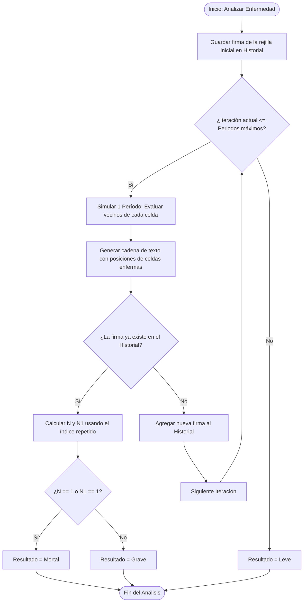

```mermaid
flowchart TD
    Inicio([Inicio: Analizar Enfermedad]) --> Inicializar[Guardar firma de la rejilla inicial en Historial]
    Inicializar --> CondicionCiclo{¿Iteración actual <= Periodos máximos?}
    
    CondicionCiclo -- Sí --> Simular[Simular 1 Período: Evaluar vecinos de cada celda]
    Simular --> GenerarFirma[Generar cadena de texto con posiciones de celdas enfermas]
    GenerarFirma --> CondicionFirma{¿La firma ya existe en el Historial?}
    
    CondicionFirma -- Sí --> CalcularN[Calcular N y N1 usando el índice repetido]
    CalcularN --> CondicionGravedad{¿N == 1 o N1 == 1?}
    
    CondicionGravedad -- Sí --> Mortal[Resultado = Mortal]
    CondicionGravedad -- No --> Grave[Resultado = Grave]
    
    Mortal --> Fin([Fin del Análisis])
    Grave --> Fin
    
    CondicionFirma -- No --> AgregarHistorial[Agregar nueva firma al Historial]
    AgregarHistorial --> Incrementar[Siguiente Iteración]
    Incrementar --> CondicionCiclo
    
    CondicionCiclo -- No --> Leve[Resultado = Leve]
    Leve --> Fin
```